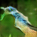

# generative-adversarial-txt-2-image-synthesis
This repo contains a TensorFlow implementation of [Generative Adversarial Text to Image Synthesis](https://arxiv.org/abs/1605.05396).

## Results
The results shown below are generated after training for ~200 epochs and with shape 64x64, where the results in the original paper were generated after 600 epochs with a higher resolution.

Image generated by feeding the caption `"a greyish-blue colored bird with a white-grey
face, and big blue feet."`:

   

Image generated by feeding the caption `"a greyish-blue colored bird with a white-grey
face, and big blue feet."`:

   

## Dataset
This model is trained using the Caltech-UCSD Birds dataset. 

The original images can be downloaded from: http://www.vision.caltech.edu/visipedia/CUB-200-2011.html
The captions for the dataset can be downloaded from:  https://drive.google.com/file/d/0B0ywwgffWnLLMl9uOU91MV80cVU/view?resourcekey=0-vy4hVV-6Hvpw3AiYipoa3g
The pretrained embeddings can be downloaded from: https://drive.google.com/file/d/0B3y_msrWZaXLT1BZdVdycDY5TEE/view?resourcekey=0-sZrhftoEfdvHq6MweAeCjA

The file: [process_birds.py](https://github.com/crisbodnar/text-to-image/blob/master/preprocess/preprocess_birds.py) 
should be used to generate the images in the correct shapes.

## Run the model

First install the requirements by running: `pip install -r requirements.txt`

CLS mode: `python run.py --mode CLS`

INT mode: `python run.py --mode INT`

CLS-INT mode: `python run.py --mode CLS-INT`

